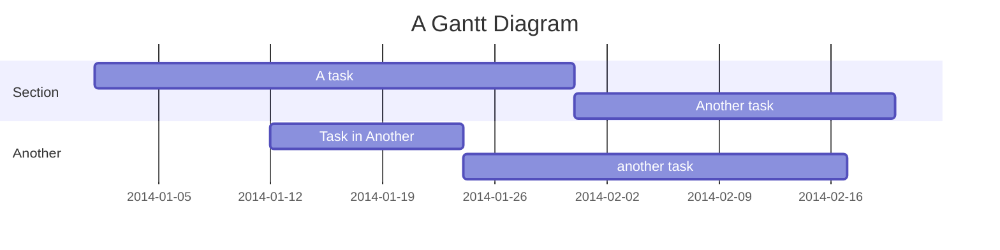

---
{"dg-publish":true,"permalink":"/my-first-note/","tags":["gardenEntry"]}
---


# This is a top-level header, or H1

Hello world!

The theme of this site should now be updated to match the appearance in Obsidian.

```swift
let x = 1
let y = 2
let z = x * y
print(z)
```


